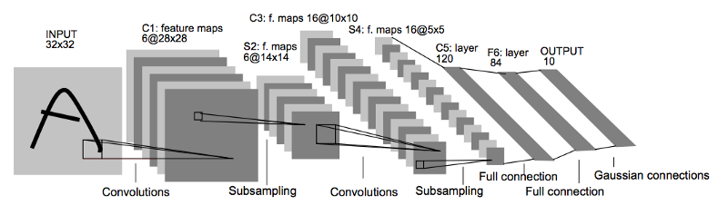

OCR of Hand-written Data using CNN
====================
**exercise tags** : `machine learning`, `computer vision`, `convolutional nueral networks`

**algorithm** : [LeNet-5](http://yann.lecun.com/exdb/lenet/)

**libraries** : [Keras](https://keras.io/), [OpenCV](https://docs.opencv.org/3.4/d5/d26/tutorial_py_knn_understanding.html), [HodaDatasetReader](https://github.com/amir-saniyan/HodaDatasetReader)

**input** : data set of handwritten farsi digits

**output** : labels of predicted numbers and data accuracy

Project Structure
--------------------
* _/DigitDB_: contains [these files](https://github.com/amir-saniyan/HodaDatasetReader/tree/master/DigitDB) as train, test, remained dataset (fill this directory if it is empty).
* _HodaDatasetReader.py_: To read Hoda `.cdb` files as images and labels (data sets).
* _main.py_ : where the project code implemented. **run this file**
* _weights.hdf5_ : weights of a model which trained at last `main.py`'s run. it can be used for "pre-trained" model implementation (see line 81 of main.py)

Main.py step-by-step description
--------------------
its available in `main.py`'s comments lines (all parts of code have been commented!).

**there is also details about model hyper parameters, arguments(such as learning rate, epochs and ...) and methods(such as accuracy evaluation, data enhancing using image generators and ...).**

LeNet-5 Model Description
--------------------
LeNet-5 contains 5 major layers (not counting the input layer and pooling layers):
* Two Convolutional Layers.
* Three Connected layers
* _(two pooling and one flatting layers)_

1. Convolution 1: Input = 32x32x1. Output = 28x28x6 | activation: `relu`
    * Pooling 1: The output shape should be 14x14x6 | method: `average pooling`
2. Convolution 2. Input = 14x14x6. Output = 10x10x16 | activation: `relu`
    * Pooling 2: The output shape should be 5x5x16 | method: `average pooling`
    * Flatting: Flatten the output shape of the final pooling layer.

3. Connected 1: Input = 5x5x16. Output = 120 | activation: `relu`
4. Connected 2: Input = 120. Output = 84 | activation: `relu`
5. Connected 3 (Logits): Output = 10 | activation: `softmax`

Implemented Model Characteristics
--------------------
Layer (type) |  |  |  |  |  | Output Shape |  |  |  |  | Params
--- | --- | --- | --- |--- |--- |--- |--- |--- |--- |--- |---
conv2d_9 (Conv2D)  |  |  |  |  |  | conv2d_9 (Conv2D)  |  |  |  |  | 60
average_pooling2d_1  |  |  |  |  |  | (Average (None, 15, 15, 6)  |  |  |  |  | 0
conv2d_10 (Conv2D)  |  |  |  |  |  | (None, 13, 13, 16)  |  |  |  |  | 880
average_pooling2d_2  |  |  |  |  |  | (Average (None, 6, 6, 16)  |  |  |  |  | 0
flatten_5 (Flatten)  |  |  |  |  |  | (None, 576) |  |  |  |  | 0
dense_13 (Dense)  |  |  |  |  |  | (None, 120) |  |  |  |  | 69240
dense_14 (Dense)  |  |  |  |  |  | (None, 84) |  |  |  |  | 10164
dense_15 (Dense)  |  |  |  |  |  | (None, 10) |  |  |  |  | 850

* Total params: 81,194
* Trainable params: 81,194
* Non-trainable params: 0

Datasets Design
-------------------
* **Train Sets** : all images and labels of the `/DigitDB/Train 60000.cdb` used for model learning.
* **Validation Sets** : all images and labels of the `/DigitDB/RemainingSamples.cdb` used for model evaluation (about 22000 sets).
* **Test Sets** : few random numbers of `/DigitDB/Test 20000.cdb` used for model testing (you can change it. see line 113 of main.py).