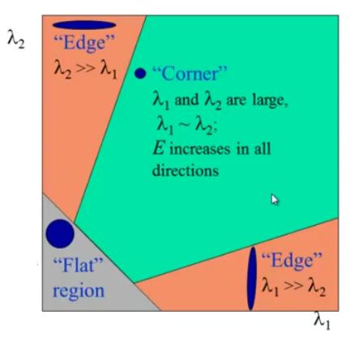

What the program does?
-----------------------
* read input image from `Images/` directory.
* convert image to gray scale
* calculate derivation of image in x and y directions
* calculate squares of derivations
* apply gaussian blur on squares of derivations
* calculate R matrix (detailed calculations mentioned below)
* detect corners by select big values of R
* show output image
* save output and all iterations images in `Output/` direction

How to run?
-----------
* run app.py file by following command: `$ python3.6 app.py`

Harris Algorithm
----------------
find the difference in intensity for a displacement of (u,v) in all directions:

Window function is either a rectangular window or gaussian window which gives weights to pixels underneath.

We have to maximize this function E(u,v) for corner detection. That means, we have to maximize the second term. Applying Taylor Expansion to above equation and using some mathematical steps (please refer any standard text books you like for full derivation), we get the final equation as:

where

Here, I_x and I_y are image derivatives in x and y directions respectively..

Then comes the main part. After this, they created a score, basically an equation, which will determine if a window can contain a corner or not.

where
* det(M) = lambda_1 * lambda_2
* trace(M) = lambda_1 + lambda_2
* lambda_1 and lambda_2 are the eigen values of M

So the values of these eigen values decide whether a region is corner, edge or flat.
* When |R| is small, which happens when lambda_1 and lambda_2 are small, the region is flat.
* When R<0, which happens when lambda_1 >> lambda_2 or vice versa, the region is edge.
* When R is large, which happens when lambda_1 and lambda_2 are large and lambda_1 sim lambda_2, the region is a corner.

It can be represented in a nice picture as follows:

